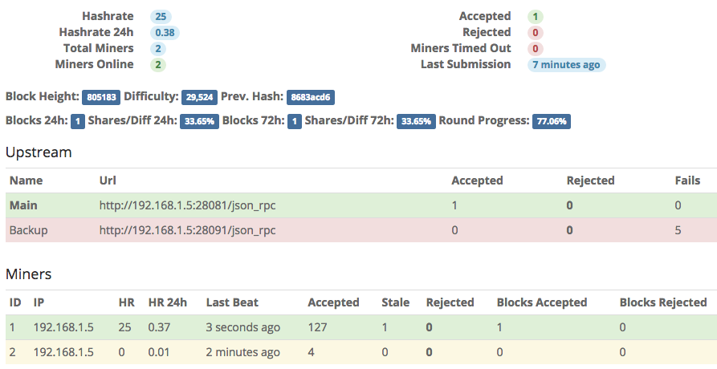

# Go-Miningcore stratum Pool

High performance stratum mining pool with Web-interface written in Golang.

**Stratum feature list:**

* Be your own pool
* Rigs availability monitoring
* Keep track of accepts, rejects, blocks stats
* Easy detection of sick rigs
* Daemon failover list
* Concurrent shares processing
* Performance Web-interface




## Algorithms Supported

- random-x
- random-xl
- random-wow
- random-arq
- random-yada


## Installation

Dependencies:

  * go-1.6
  * Monero deamon


### Linux

Use Ubuntu

Install required packages:

	sudo apt-get install git make cmake golang


Compile Monero source (with shared libraries option):

    sudo apt-get install build-essential libssl-dev pkg-config libboost-all-dev
    sudo git clone --recursive https://github.com/monero-project/monero.git
    cd monero
    sudo cmake -DBUILD_SHARED_LIBS=1 .
    sudo make

Clone Go-Miningcore stratum Pool: 

    sudo git clone https://github.com/minernl/go-miningcore.git
    cd go-miningcore

Build stratum:

    sudo MONERO_DIR=/path/to/monero cmake .
    sudo make

`MONERO_DIR=/path/to/monero` is optional, not needed if both `monero` and `go-miningcore` are in the same directory like `/opt/src/`. 
By default make will search for monero libraries in `../monero`. 
You can just run `cmake .`.


### Running Go-Miningcore

    ./build/bin/go-miningcore config.json

If you need to bind to privileged ports and don't want to run from `root`:

    sudo apt-get install libcap2-bin
    sudo setcap 'cap_net_bind_service=+ep' /path/to/go-miningcore


## Go-Miningcore Pool Configuration

Configuration is self-describing, just copy *config.example.json* to *config.json* and run stratum with path to config file as 1st argument.

```javascript
{
  // Address for block rewards
  "address": "YOUR-ADDRESS-NOT-EXCHANGE",
  // Don't validate address
  "bypassAddressValidation": true,
  // Don't validate shares
  "bypassShareValidation": true,

  "threads": 2,

  "estimationWindow": "15m",
  "luckWindow": "24h",
  "largeLuckWindow": "72h",

  // Interval to poll daemon for new jobs
  "blockRefreshInterval": "1s",

  "stratum": {
    // Socket timeout
    "timeout": "15m",

    "listen": [
      {
        "host": "0.0.0.0",
        "port": 1111,
        "diff": 5000,
        "maxConn": 32768
      },
      {
        "host": "0.0.0.0",
        "port": 3333,
        "diff": 10000,
        "maxConn": 32768
      }
    ]
  },

  "frontend": {
    "enabled": true,
    "listen": "0.0.0.0:8082",
    "login": "admin",
    "password": "",
    "hideIP": false
  },

  "upstreamCheckInterval": "5s",

  "upstream": [
    {
      "name": "Main",
      "host": "127.0.0.1",
      "port": 18081,
      "timeout": "10s"
    }
  ]
}
```

You must use `anything.WorkerID` as username in your miner. Either disable address validation or use `<address>.WorkerID` as username. If there is no workerID specified your rig stats will be merged under `0` worker. If mining software contains dev fee rounds its stats will usually appear under `0` worker. This stratum acts like your own pool, the only exception is that you will get rewarded only after block found, shares only used for stats.
